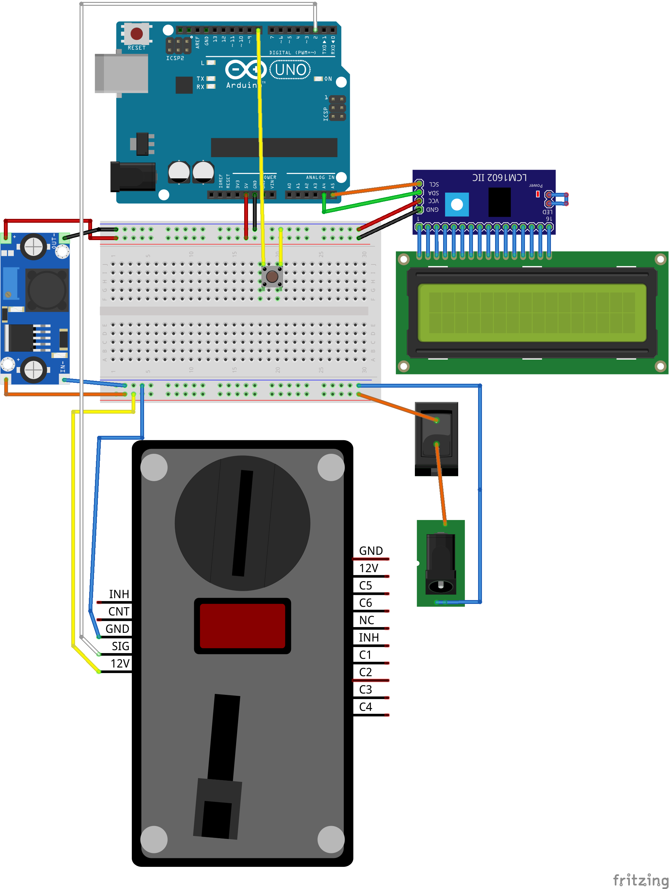
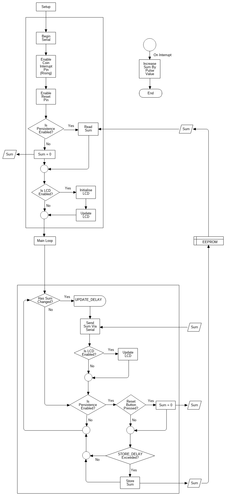

# Coin Acceptor

A coin accepting donation box, using a **CH-926** coin acceptor, Arduino and more to be figured out as we hack around...

Check out the other related repositories for additional parts of this system.

## Current Features
  - It counts coins
  - It has an LCD
  - It stores the value in EEPROM
  - Value Updates are sent over serial
  - Reset value button

## Breadboard Wiring

## Flowchart

